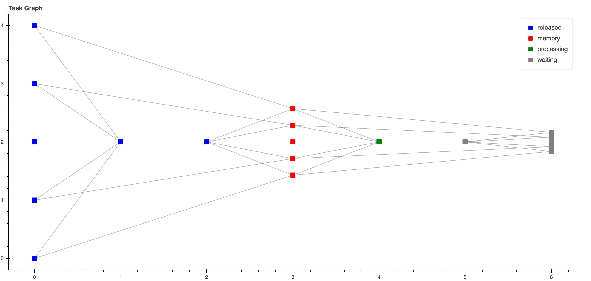

.. _bob.pipelines.dask:

Dask: Scale your scikit.learn pipelines
=======================================

`Dask <https://dask.org/>`_  is a flexible library for parallel computing in Python.
The purpose of this guide is not to describe how dask works.
For that, go to its documentation.
Moreover, there are plenty of tutorials online.
For instance, `this official one <https://github.com/dask/dask-tutorial>`_; a nice overview was presented in `AnacondaCon 2018 <https://www.youtube.com/watch?v=tQBovBvSDvA>`_ and there's even one crafted for `Idiap Personal TAM  <https://github.com/tiagofrepereira2012/tam-dask>`_.

The purpose of this guide is to describe:

    1. The integration of dask with scikit learn pipelines and samples
    2. The specificities of `Dask` under the Idiap SGE

From Scikit Learn pipelines to Dask Task Graphs
-----------------------------------------------

The purpose of :any:`sklearn.pipeline.Pipeline` is to assemble several :any:`sklearn.base.BaseEstimator` in one final one.
Then, it is possible to use the methods `fit` and `transform` to create models and transform your data respectivelly.

Any pipeline :any:`sklearn.pipeline.Pipeline` can be transformed in a dask-bag_ to be further executed by any dask-client_.
This is carried out via the :any:`wrap` function when used like ``wrap(["dask"], estimator)`` (see :ref:`bob.pipelines.wrap`).
Such function does two things:

   1. Edit the current :any:`sklearn.pipeline.Pipeline` by adding a new first step, where input samples are transformed in dask-bag_. This allows the usage of :any:`dask.bag.map` for further transformations.

   2. Wrap all :any:`sklearn.base.BaseEstimator` in the pipeline with :any:`DaskWrapper`. This wrapper is responsible for the creation of the task graph for the methods `.fit` and `.transform`.

The code snippet below enables such feature for an arbitrary :any:`sklearn.pipeline.Pipeline`.

.. code:: python

   >>> import bob.pipelines
   >>> from sklearn.pipeline import make_pipeline
   >>> pipeline = make_pipeline(...)
   >>> dask_pipeline = bob.pipelines.wrap(["dask"], pipeline) # Create a dask graph
   >>> dask_pipeline.fit_transform(....).compute() # Run the task graph using the default client

The code below is an example. Especially lines 59-63 where we convert such pipeline in a
dask-graphs_ and runs it in a local computer.

.. literalinclude:: ./python/pipeline_example_dask.py
   :linenos:
   :emphasize-lines: 48-53

Such code generates the following graph.

   This graph can be seem by running `http://localhost:8787` during its execution.

Dask + Idiap SGE
----------------

Dask, allows the deployment and parallelization of graphs either locally or in complex job queuing systems, such as PBS, SGE....
This is achieved via dask-jobqueue_.
Below follow a nice video explaining what is the dask-jobqueue_, some of its features and how to use it to run dask-graphs_.

 .. raw:: html

     <iframe width="560" height="315" src="https://www.youtube.com/embed/FXsgmwpRExM" frameborder="0" allow="accelerometer; autoplay; encrypted-media; gyroscope; picture-in-picture" allowfullscreen></iframe>

.. warning::

  To submit jobs at Idiap's SGE it's mandatory to set a project name. Run the code below to set it::

  $ bob config set sge.project <YOUR_PROJECT_NAME>

The snippet below shows how to deploy the exact same pipeline from the previous section in the Idiap SGE cluster

.. code:: python

   >>> from bob.pipelines.distributed.sge import SGEMultipleQueuesCluster
   >>> from dask.distributed import Client
   >>> cluster = SGEMultipleQueuesCluster() # Creates the SGE launcher that launches jobs in the q_1day
   >>> client = Client(cluster) # Creates the scheduler and attaching it to the SGE job queue system
   >>> dask_pipeline.fit_transform(....).compute(scheduler=client) # Runs my graph in the Idiap SGE

That's it, you just run a scikit pipeline in the Idiap SGE grid :-)

Dask provides generic deployment dask-deployment_ mechanism for SGE systems, but it contains the following limitations:

  1. It assumes that a dask-graphs_ runs in an homogeneous grid setup. For instance, if parts your graph needs a specific resource that it's avaible in other SGE queues (e.g q_gpu, q_long_gpu, IO_BIG), the scheduler is not able to request those resources on the fly.

  2. As a result of 1., the mechanism of dask-adaptative-deployment_ is not able to handle job submissions of two or more queues.

For this reason the generic SGE laucher was extended to this one :any:`bob.pipelines.distributed.sge.SGEMultipleQueuesCluster`. Next subsections presents some code samples using this launcher in the most common cases you will probably find in your daily job.

Launching jobs in different SGE queues
--------------------------------------

SGE queue specs are defined in python dictionary as in the example below, where, the root keys are the labels of the SGE queue and the other inner keys represents:

   1. **queue**: The real name of the SGE queue
   2. **memory**: The amount of memory required for the job
   3. **io_big**: Submit jobs with IO_BIG=TRUE
   4. **resource_spec**: Whatever other key using in `qsub -l`
   5. **resources**: Reference label used to tag dask-delayed_ so it will run in a specific queue. This is a very important feature the will be discussed in the next section.

.. code:: python

    >>> Q_1DAY_GPU_SPEC = {
    ...         "default": {
    ...             "queue": "q_1day",
    ...             "memory": "8GB",
    ...             "io_big": True,
    ...             "resource_spec": "",
    ...             "max_jobs": 48,
    ...             "resources": "",
    ...         },
    ...         "q_short_gpu": {
    ...             "queue": "q_short_gpu",
    ...             "memory": "12GB",
    ...             "io_big": False,
    ...             "resource_spec": "",
    ...             "max_jobs": 48,
    ...             "resources": {"q_short_gpu":1},
    ...         },
    ...     }

Now that the queue specifications are set, let's trigger some jobs.

.. code:: python

   >>> from bob.pipelines.distributed.sge import SGEMultipleQueuesCluster
   >>> from dask.distributed import Client
   >>> cluster = SGEMultipleQueuesCluster(sge_job_spec=Q_1DAY_GPU_SPEC)
   >>> client = Client(cluster) # Creating the scheduler

.. note::

    To check if the jobs were actually submitted always do `qstat`::

    $ qstat

Running estimator operations in specific SGE queues
---------------------------------------------------

Sometimes it's necessary to run parts of a :any:`sklearn.pipeline.Pipeline`  in specific SGE queues (e.g. q_1day IO_BIG or q_gpu).
The example below shows how this is approached (lines 52 to 57).
In this example, the `fit` method of `MyBoostedFitTransformer` runs on `q_short_gpu`

.. literalinclude:: ./python/pipeline_example_dask_sge_adaptive.py
   :linenos:
   :emphasize-lines: 52-57

.. include:: links.rst
