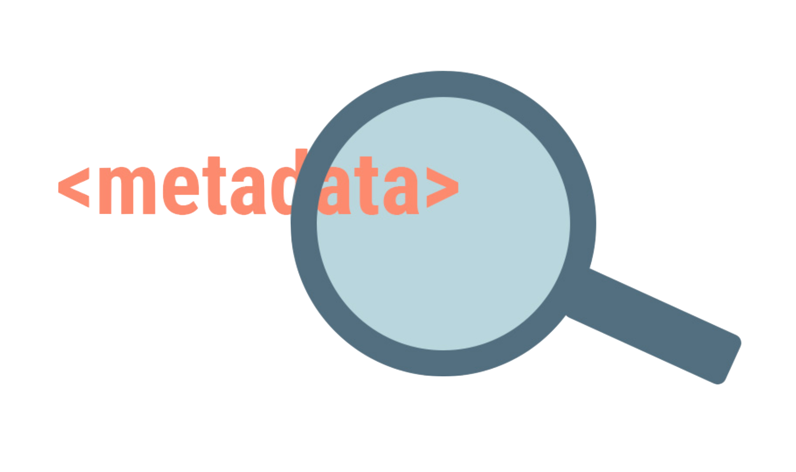
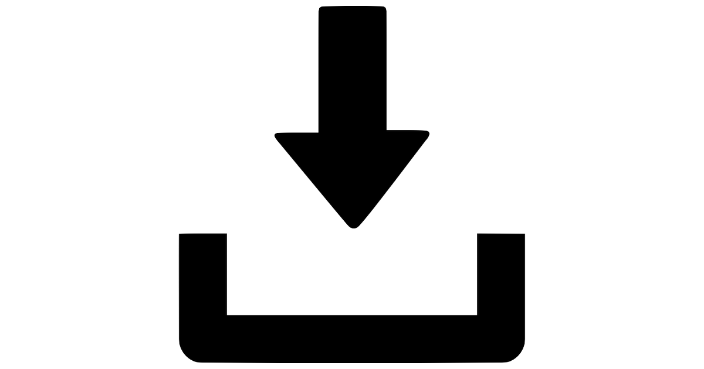

.. -*- coding: utf-8 -*-

.. _bob.pipelines:

===============
 Bob Pipelines
===============

Easily boost your :doc:`Scikit Learn Pipelines <modules/generated/sklearn.pipeline.Pipeline>` with powerful features, such as:

    Scale them with Dask

   Wrap datapoints with metadata and pass them to the `estimator.fit` and `estimator.transform` methods

   Checkpoint datapoints after each step of your pipeline

.. warning::
    Before any investigation of this package is capable of, check the scikit learn :ref:`user guide <scikit-learn:pipeline>`. Several :ref:`tutorials <scikit-learn:tutorial_menu>` are available online.

.. warning::
    If you want to implement your own scikit-learn estimator, please, check it out this :doc:`link <scikit-learn:developers/develop>`

User Guide
==========

.. toctree::
   :maxdepth: 2

   sample
   checkpoint
   dask
   xarray
   py_api
