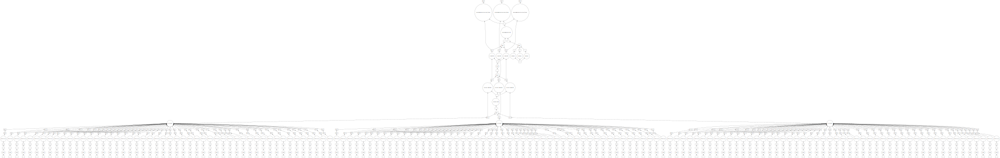
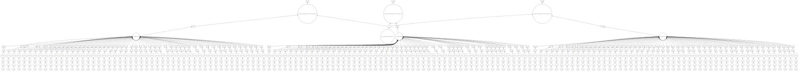

.. _bob.pipelines.dataset_pipeline:

Efficient pipelines with dask and xarray
========================================

.. note::

   This section of the API is not used by ``bob.bio`` and ``bob.pad`` packages.
   If you are only interested in learning those packages, you can skip this page.

In this guide, we will see an alternative method to what was discussed before
about sample-based processing, checkpointing, dask integration. We will be doing
the same concepts as discussed before but try to do it in a more efficient way.

In this guide we are interested in several things:

#. Sample-based processing and carrying the sample metadata over the
   pipeline.
#. Checkpointing: we may want to save intermediate steps.
#. Lazy operations and graph optimizations. We'll define all operations using
   dask and we will benefit from lazy operations and graph optimizations.
#. Failed sample handling: we may want to drop some samples in the pipeline if
   we fail to process them.
#. Scalability: we want to use dask-ml estimators to handle larger than memory
   datasets for training.

This guide builds upon `scikit-learn`_, `dask`_, and `xarray`_. If you are
not familiar with those libraries, you may want to get familiar with those
libraries first.

First, let's run our example classification problem without using the tools here
to get familiar with our examples. We are going to do an Scaler+PCA+LDA example
on the iris dataset:

.. doctest::

   >>> from sklearn import datasets
   >>> from sklearn.preprocessing import StandardScaler
   >>> from sklearn.decomposition import PCA
   >>> from sklearn.discriminant_analysis import LinearDiscriminantAnalysis
   >>> from sklearn.pipeline import make_pipeline

   >>> iris = datasets.load_iris()
   >>> scaler, pca, lda = StandardScaler(), PCA(n_components=3, random_state=0), LinearDiscriminantAnalysis()
   >>> pipeline = make_pipeline(scaler, pca, lda)

   >>> _ = pipeline.fit(iris.data, iris.target)
   >>> # scaler.fit was called
   >>> # scaler.transform was called
   >>> # pca.fit was called
   >>> # pca.transform was called
   >>> # lda.fit was called

   >>> data = pipeline.decision_function(iris.data)
   >>> # scaler.transform was called
   >>> # pca.transform was called
   >>> # lda.decision_function was called

As you can see here, the example ran fine. The ``iris.data`` was transformed
twice using ``scaler.transform`` and ``pca.transform`` but that's ok and we
could have avoided that at the cost of complexity and more memory usage.
Let's go through through this example again and increase its complexity
as we progress.

Sample-based processing
-----------------------

First, let's look at how we can turn this into a sample-based pipeline. We need
to convert our dataset to a list of samples first:

.. doctest::

   >>> import bob.pipelines
   >>> from functools import partial

   >>> def load(i):
   ...     return iris.data[i]

   >>> samples = [
   ...     bob.pipelines.DelayedSample(partial(load, i), target=y)
   ...     for i, y in enumerate(iris.target)
   ... ]
   >>> samples[0]
   DelayedSample(target=0)

You may be already familiar with our sample concept. If not, please read more on
:ref:`bob.pipelines.sample`. Now, to optimize our process, we will represent our
samples in an :any:`xarray.Dataset` using :any:`dask.array.Array`'s:

.. doctest::

   >>> dataset = bob.pipelines.xr.samples_to_dataset(samples, npartitions=3)
   >>> dataset  # doctest: +NORMALIZE_WHITESPACE
   <xarray.Dataset>
   Dimensions:  (sample: 150, dim_0: 4)
   Dimensions without coordinates: sample, dim_0
   Data variables:
      target   (sample) int64 dask.array<chunksize=(50,), meta=np.ndarray>
      data     (sample, dim_0) float64 dask.array<chunksize=(50, 4), meta=np.ndarray>

You can see here that our ``samples`` were converted to a dataset of dask
arrays. The dataset is made of two *dimensions*: ``sample`` and ``dim_0``. We
have 150 samples in our dataset and the data is made of 4 dimensional features.

We also partitioned our dataset to 3 partitions (chunks of 50 samples) to ensure
efficient and parallel processing of our data. Read up on dask arrays to become
more familiar with the idea of chunks.

If you want to give a name to ``dim_0``, you can provide a ``meta``
parameter which should a :any:`xarray.DataArray` providing information
about ``data`` in our samples:

.. doctest::

   >>> import xarray as xr

   >>> # construct the meta from one sample
   >>> meta = xr.DataArray(samples[0].data, dims=("feature"))
   >>> dataset = bob.pipelines.xr.samples_to_dataset(samples, npartitions=3, meta=meta)
   >>> dataset  # doctest: +NORMALIZE_WHITESPACE
   <xarray.Dataset>
   Dimensions:  (sample: 150, feature: 4)
   Dimensions without coordinates: sample, feature
   Data variables:
      target   (sample) int64 dask.array<chunksize=(50,), meta=np.ndarray>
      data     (sample, feature) float64 dask.array<chunksize=(50, 4), meta=np.ndarray>

Now, we want to build a pipeline that instead of numpy arrays, processes this
dataset instead. We can do that with our :any:`DatasetPipeline`. A dataset
pipeline is made of scikit-learn estimators but instead of working on numpy
arrays, it works on xarray datasets with dask arrays inside them. We will build
our pipeline using again PCA and LDA. To build a dataset pipeline, we need to
tell :any:`DatasetPipeline` which variables to pass to our estimators. By default,
:any:`DatasetPipeline` will pass the ``data`` variable to our transformer. This
will work for PCA since it only needs ``data`` in its ``.fit`` and
``.transform`` methods. However, for LDA, we also need to provide ``target``
when fitting the estimator. :any:`DatasetPipeline` as input takes a list of
estimators. If you have to give more information about an estimator, you pass a
dictionary instead.

.. doctest::

   >>> pipeline = bob.pipelines.xr.DatasetPipeline(
   ...     [
   ...         scaler,
   ...         pca,
   ...         dict(estimator=lda, fit_input=["data", "target"]),
   ...     ]
   ... )
   >>> pipeline
   DatasetPipeline(...)

The dictionaries are used to construct :any:`Block`'s. You can checkout
that class to see what options are possible.

Now let's fit our pipeline with our xarray dataset. Ideally, we want
this fit step be postponed until the we call :any:`dask.compute` on our
results. But this does not happen here which we will explain later.

.. doctest::

   >>> _ = pipeline.fit(dataset)

Now let's call ``decision_function`` on our pipeline. What will be
returned is a new dataset with the ``data`` variable changed to the
output of ``lda.decision_function``.

.. doctest::

   >>> ds = pipeline.decision_function(dataset)
   >>> ds  # doctest: +NORMALIZE_WHITESPACE
   <xarray.Dataset>
   Dimensions:  (sample: 150, c: 3)
   Dimensions without coordinates: sample, c
   Data variables:
      target   (sample) int64 dask.array<chunksize=(50,), meta=np.ndarray>
      data     (sample, c) float64 dask.array<chunksize=(50, 3), meta=np.ndarray>

To get the results as numpy arrays you can call ``.compute()`` on xarray
or dask objects:

.. doctest::

   >>> ds.compute()  # doctest: +NORMALIZE_WHITESPACE
   <xarray.Dataset>
   Dimensions:  (sample: 150, c: 3)
   Dimensions without coordinates: sample, c
   Data variables:
      target   (sample) int64 0 0 0 0 0 0 0 0 0 0 0 0 ... 2 2 2 2 2 2 2 2 2 2 2 2
      data     (sample, c) float64 28.42 -15.84 -59.68 20.69 ... -57.81 3.79 6.92

Our operations were not lazy here (you can't see in the docs that it was not
lazy but if you increase logging's verbosity in your code, you will see) because
we had unknown dimensions. Whenever :any:`DatasetPipeline` is faced with an
unknown dimension, it will compute all the computations till then (using
:any:`dask.persist`) and then continues with valid size dimensions. A workaround to
this is to provide the feature size of each estimator to :any:`DatasetPipeline`.
You have to provide a list of size 2 tuples of ``(dim_name, dim_size)``. The
``dim_name`` must not overlap with what is already in the dataset unless it has
the same size. If your estimator does not change the dimension sizes, you can
provide ``None`` as dimension size and this will be inferred from the dataset.
For new and unknown dimension sizes use `np.nan`.

.. doctest::

   >>> pipeline = bob.pipelines.xr.DatasetPipeline(
   ...     [
   ...         # scaler output is the same size as input `feature`
   ...         dict(estimator=scaler, output_dims=[("feature", None)]),
   ...         # pca feature size is 3. You can't call this dimension `feature`
   ...         # because it's already in the input dataset with a different size
   ...         dict(estimator=pca, output_dims=[("pca_feature", 3)]),
   ...         # size of the output of lda.decision_function is 3
   ...         # because we have 3 classes in our problem
   ...         dict(estimator=lda, fit_input=["data", "target"], output_dims=[("class", 3)]),
   ...     ]
   ... )
   >>> pipeline
   DatasetPipeline(...)

   >>> ds = pipeline.fit(dataset).decision_function(dataset)
   >>> ds  # doctest: +NORMALIZE_WHITESPACE
   <xarray.Dataset>
   Dimensions:  (sample: 150, class: 3)
   Dimensions without coordinates: sample, class
   Data variables:
      target   (sample) int64 dask.array<chunksize=(50,), meta=np.ndarray>
      data     (sample, class) float64 dask.array<chunksize=(50, 3), meta=np.ndarray>

This time nothing was computed. We can get the results by calling
``ds.compute()``:

.. doctest::

   >>> ds.compute()  # doctest: +NORMALIZE_WHITESPACE
   <xarray.Dataset>
   Dimensions:  (sample: 150, class: 3)
   Dimensions without coordinates: sample, class
   Data variables:
      target   (sample) int64 0 0 0 0 0 0 0 0 0 0 0 0 ... 2 2 2 2 2 2 2 2 2 2 2 2
      data     (sample, class) float64 28.42 -15.84 -59.68 ... -57.81 3.79 6.92
   >>> ds.data.data.visualize(format="svg")  # doctest: +SKIP

In the visualization of the dask graph below, you can see that dask is only
executing ``scaler.transform`` and ``pca.transform`` once.

Checkpointing
-------------

We may want to checkpoint features or save our fitted estimators for
later use. Also, we might want to do this checkpointing to inspect our
features. Let's add the ``key`` metadata to our dataset first:

.. doctest::

   >>> def load(i):
   ...     return iris.data[i]

   >>> samples = [
   ...     bob.pipelines.DelayedSample(partial(load, i), target=y, key=i)
   ...     for i, y in enumerate(iris.target)
   ... ]
   >>> samples[0]
   DelayedSample(target=0, key=0)

   >>> # construct the meta from one sample
   >>> meta = xr.DataArray(samples[0].data, dims=("feature"))
   >>> dataset = bob.pipelines.xr.samples_to_dataset(samples, npartitions=3, meta=meta)
   >>> dataset  # doctest: +NORMALIZE_WHITESPACE
   <xarray.Dataset>
   Dimensions:  (sample: 150, feature: 4)
   Dimensions without coordinates: sample, feature
   Data variables:
      target   (sample) int64 dask.array<chunksize=(50,), meta=np.ndarray>
      key      (sample) int64 dask.array<chunksize=(50,), meta=np.ndarray>
      data     (sample, feature) float64 dask.array<chunksize=(50, 4), meta=np.ndarray>

.. testsetup::

   import tempfile
   tempdir = tempfile.TemporaryDirectory().name

To checkpoint estimators, all we need is to provide a ``model_path`` or
``features_dir`` in our pipeline and it will checkpont the model or the
features:

.. doctest::

   >>> import os

   >>> scaler_model = os.path.join(tempdir, "scaler.pkl")
   >>> pca_model = os.path.join(tempdir, "pca.pkl")
   >>> pca_features = os.path.join(tempdir, "pca_features")
   >>> lda_model = os.path.join(tempdir, "lda.pkl")

   >>> pipeline = bob.pipelines.xr.DatasetPipeline(
   ...     [
   ...         dict(estimator=scaler, output_dims=[("feature", None)],
   ...              model_path=scaler_model),
   ...         dict(estimator=pca, output_dims=[("pca_feature", 3)],
   ...              model_path=pca_model, features_dir=pca_features),
   ...         dict(estimator=lda, fit_input=["data", "target"], output_dims=[("class", 3)],
   ...              model_path=lda_model),
   ...     ]
   ... )

   >>> ds = pipeline.fit(dataset).decision_function(dataset)
   >>> ds.compute()  # doctest: +NORMALIZE_WHITESPACE
   <xarray.Dataset>
   Dimensions:  (sample: 150, class: 3)
   Dimensions without coordinates: sample, class
   Data variables:
      target   (sample) int64 0 0 0 0 0 0 0 0 0 0 0 0 ... 2 2 2 2 2 2 2 2 2 2 2 2
      key      (sample) int64 0 1 2 3 4 5 6 7 ... 142 143 144 145 146 147 148 149
      data     (sample, class) float64 28.42 -15.84 -59.68 ... -57.81 3.79 6.92

Now if you repeat the operations, the checkpoints will be used:

.. doctest::

   >>> ds = pipeline.fit(dataset).decision_function(dataset)
   >>> ds.compute()  # doctest: +NORMALIZE_WHITESPACE
   <xarray.Dataset>
   Dimensions:  (sample: 150, class: 3)
   Dimensions without coordinates: sample, class
   Data variables:
      target   (sample) int64 0 0 0 0 0 0 0 0 0 0 0 0 ... 2 2 2 2 2 2 2 2 2 2 2 2
      key      (sample) int64 0 1 2 3 4 5 6 7 ... 142 143 144 145 146 147 148 149
      data     (sample, class) float64 28.42 -15.84 -59.68 ... -57.81 3.79 6.92

   >>> ds.data.data.visualize(format="svg")  # doctest: +SKIP

In the visualization of the dask graph below, you can see that dask is only
executing ``lda.decision_function`` and loading pca features and lda model from
disk.

.. testcleanup::

   import shutil
   shutil.rmtree(tempdir, ignore_errors=True)

Handling failed processing of Samples
-------------------------------------

Imagine that in your pipeline, you may want to drop some samples because you
were unable to process them or they were low quality samples.
:any:`DatasetPipeline` provides a generic option for applying a function on the
whole dataset. Instead of providing an estimator, you just provide a function
that takes as input a dataset and returns a modified dataset. This mechanism can
be used for example to drop samples. To signal that we have failed processing a
sample, we will put ``np.nan`` in the data of our failed samples.

Imagine, the following PCA class that fails to process every other sample:

.. doctest::

   >>> import numpy as np
   >>> class FailingPCA(PCA):
   ...     def transform(self, X):
   ...         Xt = super().transform(X)
   ...         Xt[::2] = np.nan
   ...         return Xt

Now in our pipeline, we want to drop ``nan`` samples after PCA transformations:

.. doctest::

   >>> failing_pca = FailingPCA(n_components=3, random_state=0)
   >>> pipeline = bob.pipelines.xr.DatasetPipeline(
   ...     [
   ...         dict(estimator=scaler, output_dims=[("feature", None)]),
   ...         dict(estimator=failing_pca, output_dims=[("pca_feature", 3)]),
   ...         dict(dataset_map=lambda x: x.persist().dropna("sample")),
   ...         dict(estimator=lda, fit_input=["data", "target"], output_dims=[("class", 3)]),
   ...     ]
   ... )
   >>> ds = pipeline.fit(dataset).decision_function(dataset)
   >>> ds.compute()  # doctest: +NORMALIZE_WHITESPACE
   <xarray.Dataset>
   Dimensions:  (sample: 75, class: 3)
   Dimensions without coordinates: sample, class
   Data variables:
      target   (sample) int64 0 0 0 0 0 0 0 0 0 0 0 0 ... 2 2 2 2 2 2 2 2 2 2 2 2
      key      (sample) int64 1 3 5 7 9 11 13 15 ... 137 139 141 143 145 147 149
      data     (sample, class) float64 21.74 -13.45 -54.81 ... -58.76 4.178 8.07

You can see that we have 75 samples now instead of 150 samples. The
``dataset_map`` option is generic. You can apply any operation in this function.

Training on datasets larger than memory
---------------------------------------

Sometimes your dataset is larger than your machine's memory and this prevents
you to train (``.fit``) your estimator(s). Luckily since our data are already
dask arrays, we can use `dask-ml`_ estimators to overcome this. When you
provide dask-ml estimators, set ``input_dask_array`` as ``True``.

.. doctest::

   >>> # It's always a good idea to shuffle the samples if you are doing
   >>> # partial_fit.
   >>> dataset = bob.pipelines.xr.samples_to_dataset(
   ...     samples, npartitions=3, meta=meta, shuffle=True)

   >>> from sklearn.linear_model import SGDClassifier
   >>> import dask_ml.preprocessing, dask_ml.decomposition, dask_ml.wrappers
   >>> # construct the estimators
   >>> scaler = dask_ml.preprocessing.StandardScaler()
   >>> pca = dask_ml.decomposition.PCA(n_components=3, random_state=0)
   >>> clf = SGDClassifier(random_state=0, loss='log_loss', penalty='l2', tol=1e-3)
   >>> clf = dask_ml.wrappers.Incremental(clf, scoring="accuracy")

   >>> pipeline = bob.pipelines.xr.DatasetPipeline(
   ...     [
   ...         dict(
   ...             estimator=scaler,
   ...             output_dims=[("feature", None)],
   ...             input_dask_array=True,
   ...         ),
   ...         dict(
   ...             estimator=pca,
   ...             output_dims=[("pca_features", 3)],
   ...             input_dask_array=True,
   ...         ),
   ...         dict(
   ...             estimator=clf,
   ...             fit_input=["data", "target"],
   ...             output_dims=[],  # since we are going to call `.predict`
   ...             input_dask_array=True,
   ...             fit_kwargs=dict(classes=range(3)),
   ...         ),
   ...     ]
   ... )

   >>> ds = pipeline.fit(dataset).predict(dataset)
   >>> ds = ds.compute()
   >>> correct_classification = np.array(ds.data == ds.target).sum()
   >>> correct_classification > 85
   True
   >>> ds.dims == {"sample": 150}
   True

.. include:: links.rst
